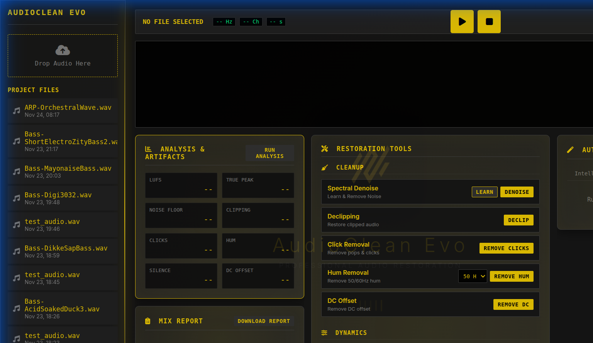
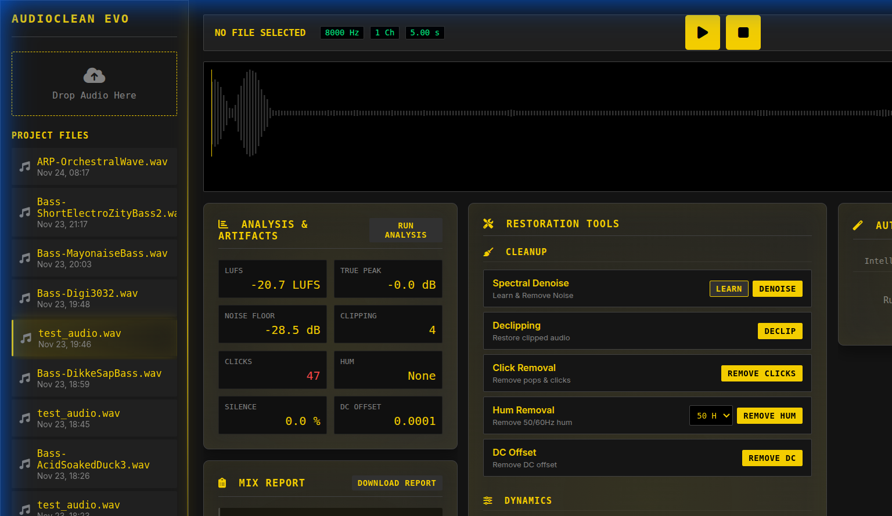

# AudioClean Evo 🎵

> Professional audio restoration and enhancement tool with AI-powered suggestions and automated workflows.


## ✨ Features

### 🎯 Professional Audio Analysis
- **Comprehensive Metrics**: LUFS, True Peak, Dynamic Range, Spectral Centroid, Crest Factor
- **Frequency Analysis**: Detailed breakdown across 6 frequency bands (Bass, Low-mids, Mids, High-mids, Presence, Highs)
- **Artifact Detection**: Advanced algorithms for clicks, hum (50/60Hz + harmonics), sibilance, DC offset, phase issues
- **Stereo Analysis**: Phase correlation and stereo width measurement

### 🔧 Professional Restoration Tools
- **Spectral Denoise**: Learn noise profiles and apply intelligent noise reduction
- **Declipping**: Restore clipped audio using cubic spline interpolation
- **Click Removal**: MAD-based transient detection and repair
- **Hum Removal**: Precision notch filters at fundamental + harmonics
- **DC Offset Removal**: Center waveform for optimal processing
- **Parametric EQ**: Multi-band frequency shaping
- **Compression**: Dynamic range control with precise parameters
- **De-esser**: Reduce vocal sibilance (5-8 kHz range)
- **Limiter**: Brickwall peak limiting
- **Stereo Width**: Mid-side processing for width adjustment
- **Smart Normalize**: LUFS-based loudness normalization

### 🤖 AI-Powered Intelligence
- **Professional Suggestions**: Detailed engineering advice with specific parameters
  - Exact frequencies, Q values, and gain amounts for EQ
  - Compression parameters (threshold, ratio, attack, release)
  - Platform-specific targets (Spotify, Apple Music, YouTube, Broadcast)
  - Step-by-step restoration workflows
- **Auto-Restoration**: Intelligent workflow that analyzes issues and applies fixes in optimal order
- **Streaming Compliance**: Automatic checks for major platform standards

### 🎨 Modern UI/UX
- **3-Column Workflow**: Analysis → Restoration Tools → Auto-Restoration
- **Real-time Waveform**: Interactive visualization with WaveSurfer.js
- **Spectrogram View**: Time-frequency analysis for surgical editing
- **Dark Mode**: Professional carbon-gray theme with yellow accents
- **Responsive Design**: Optimized for professional studio workflows

## � Screenshots

### Main Interface

*Professional 3-column layout with waveform visualization, restoration tools, and analysis panel*

### Analysis Results & Mix Report

*Comprehensive audio analysis with AI-powered suggestions and professional engineering advice*

## �🚀 Quick Start

### Prerequisites
- Python 3.8 or higher
- pip (Python package manager)
- Virtual environment (recommended)

### Installation

1. **Clone the repository**
```bash
git clone https://github.com/nicocodeevo-ux/audioclean.git
cd audioclean
```

2. **Create and activate virtual environment**
```bash
python3 -m venv venv
source venv/bin/activate  # On Windows: venv\Scripts\activate
```

3. **Install dependencies**
```bash
pip install -r requirements.txt
```

4. **Run database migrations**
```bash
python manage.py migrate
```

5. **Start the development server**
```bash
python manage.py runserver
```

6. **Open your browser**
```
http://127.0.0.1:8000
```

## 📖 Usage Guide

### Basic Workflow

1. **Upload Audio**: Drag and drop or click to upload WAV/MP3 files
2. **Analyze**: Click "Run Analysis" to get comprehensive metrics and AI suggestions
3. **Review Suggestions**: Professional engineering advice in the Mix Report panel
4. **Manual Restoration**: Apply individual tools from the Restoration section
5. **Auto-Restoration**: Click "Auto Fix" for intelligent automated workflow
6. **Download**: Export your restored audio

### Professional Suggestions Examples

```
High noise floor (-35.0 dB).

Professional Denoise Workflow:
1. Select silent/noise-only section (2-5 seconds)
2. Click "Learn Noise" to capture profile
3. Apply spectral denoise (67% reduction)
4. Follow with gentle HPF at 80 Hz to remove rumble
5. If needed: EQ boost at 3-5 kHz (+2 dB, Q=1.5) to restore clarity
```

```
Thin/weak bass (-15.0 dB, -7.0 dB below mids).

Bass Enhancement EQ:
1. Low shelf boost at 100 Hz: +3 to +5 dB (Q=0.7)
2. Or: Parametric boost at 80-120 Hz: +4 dB (Q=1.2)
3. Optional: HPF at 30-40 Hz to remove rumble
```

### Streaming Platform Targets

| Platform | Target LUFS | True Peak |
|----------|-------------|-----------|
| Spotify | -14 LUFS | -1 dB |
| Apple Music | -16 LUFS | -1 dB |
| YouTube | -13 to -15 LUFS | -2 dB |
| Broadcast (EBU R128) | -23 LUFS | -1 dB |

## 🛠️ Technology Stack

### Backend
- **Django 4.2+**: Web framework
- **Python 3.8+**: Core language
- **librosa**: Audio analysis and feature extraction
- **noisereduce**: Spectral noise reduction
- **pyloudnorm**: LUFS measurement (ITU-R BS.1770-4)
- **pedalboard**: Professional audio effects (Spotify)
- **scipy**: Signal processing and filtering
- **soundfile**: Audio I/O
- **numpy**: Numerical computing

### Frontend
- **WaveSurfer.js**: Waveform visualization and playback
- **Vanilla JavaScript**: Interactive UI logic
- **CSS3**: Modern styling with carbon-gray/yellow theme
- **Font Awesome**: Professional iconography

## 📁 Project Structure

```
audioclean_evo/
├── studio/
│   ├── audio_processor.py           # Core analysis & restoration
│   ├── audio_processor_restoration.py # Professional restoration algorithms
│   ├── audio_analysis.py            # Audio analysis algorithms
│   ├── models.py                     # Database models
│   ├── views.py                      # Django views/API endpoints
│   └── urls.py                       # URL routing
├── templates/
│   └── studio/
│       ├── base.html                 # Base template
│       └── index.html                # Main UI
├── static/
│   ├── css/
│   │   ├── style.css                # Main styles
│   │   └── auto-restore.css         # Auto-restoration styles
│   └── js/
│       └── studio.js                # Frontend logic
├── media/
│   └── audio/                       # Uploaded/processed files
├── manage.py                        # Django management
└── requirements.txt                 # Python dependencies
```

## 🔬 Advanced Features

### Analysis Algorithms

**True Peak Detection**: 4x upsampling with interpolation for inter-sample peak detection

**Spectral Centroid**: Weighted average of frequencies, indicates "brightness"

**Dynamic Range**: Peak-to-RMS ratio in dB (8-14 dB optimal for modern music)

**MAD-based Click Detection**: Median Absolute Deviation for robust outlier detection

**Harmonic Hum Analysis**: Detects fundamental (50/60Hz) + 2nd, 3rd, 4th harmonics

### Restoration Techniques

**Declipping**: Cubic spline interpolation for smooth waveform restoration

**Spectral Denoise**: FFT-based noise profiling with configurable reduction

**Notch Filtering**: High-Q (Q=30) filters for surgical hum removal

**Mid-Side Processing**: Stereo width control while maintaining mono compatibility

## 🤝 Contributing

Contributions are welcome! Please feel free to submit a Pull Request.

1. Fork the repository
2. Create your feature branch (`git checkout -b feature/AmazingFeature`)
3. Commit your changes (`git commit -m 'Add some AmazingFeature'`)
4. Push to the branch (`git push origin feature/AmazingFeature`)
5. Open a Pull Request

## 📝 License

This project is licensed under the MIT License - see the [LICENSE](LICENSE) file for details.

## 🙏 Acknowledgments

- Built with inspiration from professional tools like iZotope RX and Audacity
- Uses Spotify's [Pedalboard](https://github.com/spotify/pedalboard) library for audio effects
- Implements standards from Bob Katz's K-System and EBU R128
- UI/UX principles from the professional audio engineering knowledge base

## 📧 Contact

For questions, suggestions, or issues:
- Open an issue on GitHub
- Repository: https://github.com/nicocodeevo-ux/audioclean

## 🗺️ Roadmap

- [ ] K-System metering visualization
- [ ] FFT size control for spectrogram
- [ ] A/B comparison with loudness matching
- [ ] Batch processing
- [ ] Spectral painting tools (Canvas-based editor)
- [ ] Real-time processing preview

---

**Made with ❤️ for audio engineers and producers**
